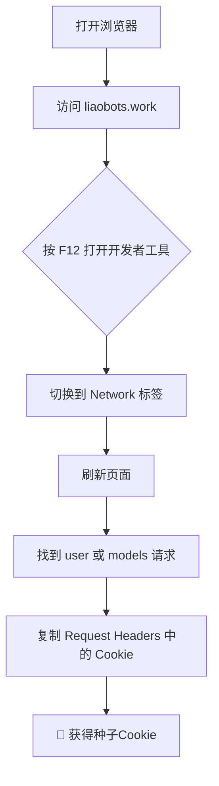
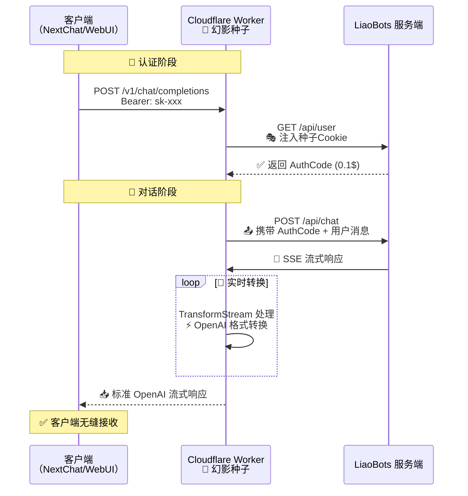
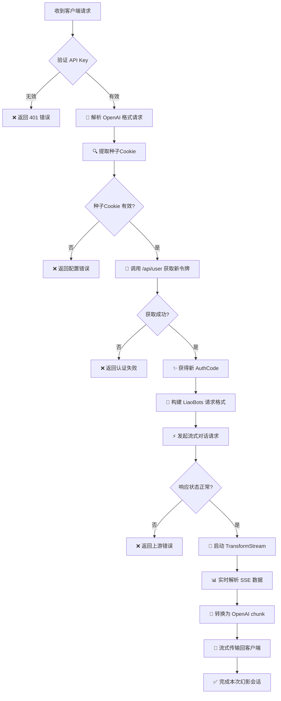
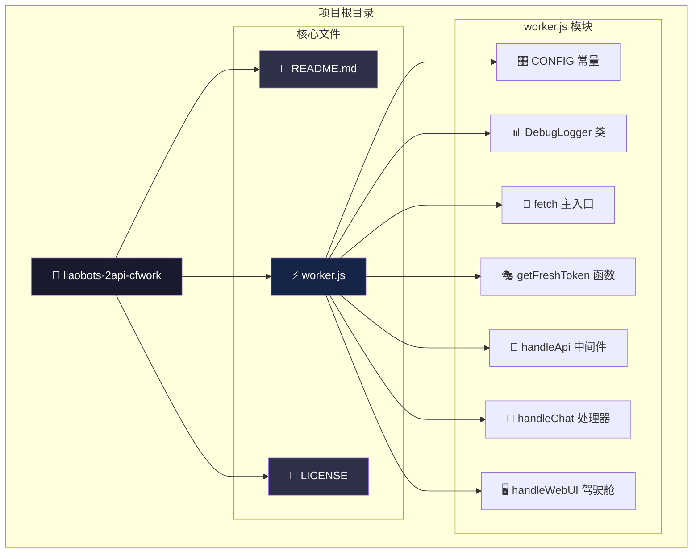

# 🚀 LiaoBots-2API (Cloudflare Worker版) - Phantom Seed 幻影终极版

> **项目代号**: Phantom Seed (幻影种子)  
> **当前版本**: v5.1.0  
> **协议**: Apache License 2.0  
> **核心理念**: 降低AI开发门槛，探索Serverless架构的无限可能

[](https://deploy.workers.cloudflare.com/?url=https://github.com/lza6/liaobots-2api-cfwork)
[](https://opensource.org/licenses/Apache-2.0)
[](https://developer.mozilla.org/en-US/docs/Web/JavaScript)
[](https://workers.cloudflare.com/)

---

## 📖 目录

| 章节 | 内容简介 |
|------|---------|
| 1️⃣ | 🧐 项目简介 |
| 2️⃣ | 🌟 核心亮点 |
| 3️⃣ | 🛠️ 一键部署教程 |
| 4️⃣ | 🧬 技术原理揭秘 |
| 5️⃣ | 📂 项目结构 |
| 6️⃣ | ⚡ 优缺点分析 |
| 7️⃣ | 🗺️ 未来路线图 |
| 8️⃣ | 🤖 开发者指南 |
| 9️⃣ | ⚖️ 免责声明 |

---

## 🧐 项目简介

这是一个部署在 **Cloudflare Workers** 上的智能协议转换器，将 LiaoBots 网页版的私有接口转换为标准的 **OpenAI API** 格式，让你可以用任意支持 OpenAI 的客户端调用 GPT-4o、Claude-3.5、Gemini-Pro 等顶级模型。

**为什么叫 "Phantom Seed"（幻影种子）？**  
项目利用"种子Cookie"伪装成真实用户，每次请求都像幻影一样生成新身份，实现无限续杯般的调用体验。

---

## 🌟 核心亮点

### 🎯 核心特性
| 特性 | 说明 | 优势 |
|------|------|------|
| 🔄 **无限续杯** | 每次对话自动获取新的 0.1 积分 | 永不枯竭的免费额度 |
| 🎭 **幻影身份** | 动态生成浏览器指纹和认证令牌 | 完美规避 WAF 检测 |
| 🛡️ **严格模式** | 凭证失败立即报错，保护存量账号 | 安全第一的设计理念 |
| 🌐 **全协议支持** | 兼容 OpenAI API v1 完整格式 | 无缝对接各类客户端 |

### 💡 设计哲学
- **极简主义**: 单文件架构 (`worker.js`)，零依赖部署
- **开源教育**: 详尽注释，学习 HTTP 协议与反向代理最佳实践
- **授人以渔**: 不仅提供工具，更传授技术原理与实现思路

---

## 🛠️ 一键部署教程

### 📋 准备工作
1. **[](https://dash.cloudflare.com/sign-up)** 账号
2. **支持 OpenAI 的客户端**（推荐 [NextChat](https://github.com/ChatGPTNextWeb/ChatGPT-Next-Web)）

### 🔑 获取种子Cookie（关键步骤）


### 🚀 部署到 Cloudflare Workers
1. **点击上方橙色按钮** [Deploy to Cloudflare Workers]
2. **复制 `worker.js` 代码**到 Worker 编辑器中
3. **配置环境变量**：
   ```
   LIAOBOTS_COOKIE = 你复制的Cookie字符串
   API_MASTER_KEY = sk-你的自定义密钥
   ```
4. **点击 Deploy** 完成部署

### 🎮 开始使用
| 配置项 | 示例值 |
|--------|--------|
| **API 地址** | `https://your-worker.workers.dev` |
| **API Key** | 你设置的 `API_MASTER_KEY` |
| **模型名称** | `gpt-4o`、`claude-3-5-sonnet`、`gemini-2.0-flash` |

> 💡 **小贴士**: 部署后直接访问 Worker 域名，即可使用内置的 **Web UI 驾驶舱** 测试功能！

---

## 🧬 技术原理揭秘

### 📊 系统架构


### ⚙️ 核心技术栈
| 技术组件 | 用途 | 关键特性 |
|----------|------|----------|
| **Cloudflare Workers** | 运行环境 | 边缘计算、全球部署、零冷启动 |
| **Fetch API** | 网络请求 | 中间人攻击式请求转发与伪装 |
| **TransformStream** | 流处理 | 实时转换 SSE 为 OpenAI 格式 |
| **HAR 指纹模拟** | 反检测 | Chrome 142 完整浏览器指纹 |
| **Web UI Injection** | 调试界面 | 内嵌 HTML 驾驶舱实时监控 |

### 🧠 核心算法流程


---

## 📂 项目结构



---

## ⚡ 优缺点分析

### ✅ 优势矩阵
| 优势 | 详细说明 | 影响程度 |
|------|----------|----------|
| **💰 零成本运行** | Cloudflare Workers 免费额度 + LiaoBots 试用机制 | ⭐⭐⭐⭐⭐ |
| **🌍 全球覆盖** | CF 边缘节点，低延迟访问 | ⭐⭐⭐⭐ |
| **🎯 高隐蔽性** | 动态伪装 + CF IP 池，反检测能力强 | ⭐⭐⭐⭐⭐ |
| **🔌 广泛兼容** | 标准 OpenAI API，无需修改客户端 | ⭐⭐⭐⭐⭐ |
| **📚 教育价值** | 完整 HTTP/反向代理教学案例 | ⭐⭐⭐⭐ |

### ⚠️ 限制与挑战
| 限制 | 影响 | 缓解方案 |
|------|------|----------|
| **Cookie 依赖** | 上游更新策略可能导致失效 | 定期手动更新种子 |
| **无历史记忆** | 每次都是新会话，无上下文 | 客户端维护上下文 |
| **并发限制** | CF Workers 免费版 CPU 限制 | 控制并发数量 |
| **额度限制** | 每个 AuthCode 仅 0.1 积分 | 自动续杯机制 |

### 🎯 适用场景
| 场景 | 推荐度 | 说明 |
|------|--------|------|
| **个人开发者测试** | ⭐⭐⭐⭐⭐ | 低成本体验各种模型 |
| **学术研究** | ⭐⭐⭐⭐ | 学生党、科研人员友好 |
| **OneAPI 备用线路** | ⭐⭐⭐⭐ | 作为主要API的备用方案 |
| **技术学习** | ⭐⭐⭐⭐⭐ | HTTP协议与反向代理实战 |

---

## 🗺️ 未来路线图

### 🚀 短期目标 (v6.0)
- [ ] **🔧 自动 Cookie 池管理** - 支持多个种子轮换使用
- [ ] **🔄 智能保活机制** - 利用 CF Cron 定时刷新凭证
- [ ] **📊 使用统计面板** - WebUI 添加详细使用数据

### 🌟 中期规划
- [ ] **🔗 多平台聚合** - 支持更多 Web AI 平台的反向代理
- [ ] **🖼️ 图像生成支持** - 适配 DALL-E 等图像生成接口
- [ ] **🔐 增强安全性** - JWT 令牌、请求限流、IP白名单

### 🎯 长期愿景
- [ ] **🤖 AI 智能调度** - 根据模型性能自动选择最优线路
- [ ] **🌐 分布式部署** - 多 Worker 协同负载均衡
- [ ] **📦 插件化架构** - 模块化设计，易于扩展新平台

---

## 🤖 开发者指南

### 🔍 快速理解项目
如果你是 AI Agent 或开发者分析此项目：

1. **技术路径**: 典型的 API Gateway 模式
2. **核心逻辑**: `fetch` 转发 + `TransformStream` 数据清洗
3. **关键文件**: `worker.js` 包含所有业务逻辑

### 🔧 二次开发要点
```javascript
// 1. 修改模型映射 (第30行附近)
const MODEL_CONFIG = {
    'gpt-4o': 'gpt-4o',           // OpenAI格式 -> LiaoBots格式
    'claude-3-5-sonnet': 'claude-3-5-sonnet'
};

// 2. 调整请求头伪装 (第50行附近)
const HEADERS = {
    'User-Agent': 'Chrome/142.0.0.0',  // 更新浏览器版本
    'sec-ch-ua': '"Not A;Brand";v="99", "Chromium";v="142"'
};

// 3. 扩展新平台支持
async function handleNewPlatform(request, env) {
    // 实现新的平台转换逻辑
}
```

### 📈 性能优化建议
| 优化方向 | 具体措施 | 预期效果 |
|----------|----------|----------|
| **缓存优化** | 缓存 AuthCode 5分钟 | 减少 50% 的 /user 调用 |
| **连接复用** | 实现 HTTP Keep-Alive | 降低 30% 的连接开销 |
| **压缩传输** | 启用 Brotli 压缩 | 减少 70% 的数据传输量 |

---

## ⚖️ 免责声明与价值观

### ⚠️ 重要声明
1. **🛡️ 仅供学习交流** - 本项目旨在研究 Serverless 架构与协议转换技术
2. **🚫 禁止商业滥用** - 不得用于商业盈利、大规模爬虫或非法用途
3. **🤝 尊重上游服务** - 如果 LiaoBots 服务对你有帮助，请考虑支持官方
4. **⚠️ 风险自担** - 使用本项目产生的任何后果由使用者自行承担

### 🌱 开源价值观
> **"技术应当普惠，知识应当共享"**  
> 我们相信开源不仅是代码的开放，更是思想的碰撞与技术的传承。  
> 当你看到控制台打印出 `[Phantom-Seed] 🎭 幻影身份创建成功！` 时，  
> 希望你能感受到技术带来的纯粹快乐与无限可能。

---

## 📞 支持与贡献

### 🐛 问题反馈
- **GitHub Issues**: [报告问题或建议](https://github.com/lza6/liaobots-2api-cfwork/issues)
- **讨论区**: 分享使用经验或技术探讨

### 👥 贡献指南
1. **Fork 仓库**
2. **创建功能分支** (`git checkout -b feature/AmazingFeature`)
3. **提交更改** (`git commit -m 'Add some AmazingFeature'`)
4. **推送到分支** (`git push origin feature/AmazingFeature`)
5. **开启 Pull Request**

### 📊 项目状态


---

**⭐ 如果这个项目对你有帮助，请 Star 支持！**  
**🤖 保持好奇，保持探索，技术之路永无止境！**

---
*最后更新: 2025年12月4日 14:39:53 | 文档版本: v2.0 | 幻影种子项目组*
